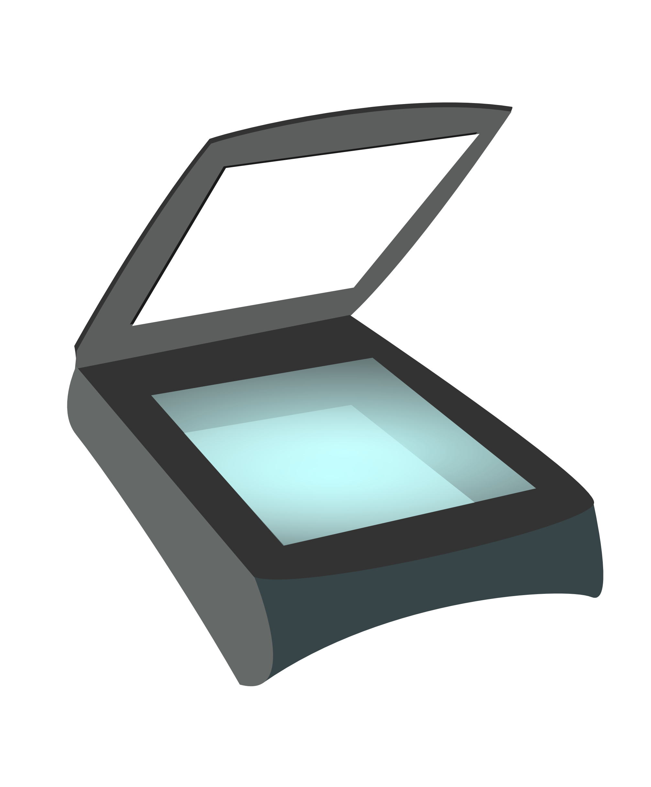

# Descan 

Descan je studentski projekat rađen na kursu Razvoj Softvera u okviru [Matematičkog fakulteta u Beogradu](http://www.matf.bg.ac.rs/). Glavni cilj ovog softvera je da korisnik na lak i brz način konvertuje svoje slike u pdf dokument. Osim ove osnovne funkcionalnosti, korisniku je omogućeno da slikama promeni dimenziju i da primeni razne efekte. Nakon toga korisnik može dodatno svoj pdf dokument da kompresuje (smanji njegovu veličinu), da pošalje na mejl ili da postavi na Google Drive. Osim rada sa slikama, omogućen je i rad sa pdf dokumentima i to spajanje više dokumenata u jedan, kao i razdvajanje jednog dokumenta u više različitih. Uputstvo za instaliranje biblioteka i pokretanje projekta se može videti [ovde](https://gitlab.com/matf-bg-ac-rs/course-rs/projects-2020-2021/07-descan/-/wikis/Instalacija-i-pokretanje).

## Developers

- [Jelena Milivojević, 4/2016](https://gitlab.com/ratspeaker)
- [Anđela Milićević, 53/2016](https://gitlab.com/andjaam)
- [Dušica Golubović, 119/2016](https://gitlab.com/golubovicd)
- [Marija Marković, 76/2016](https://gitlab.com/marija.markovic)
