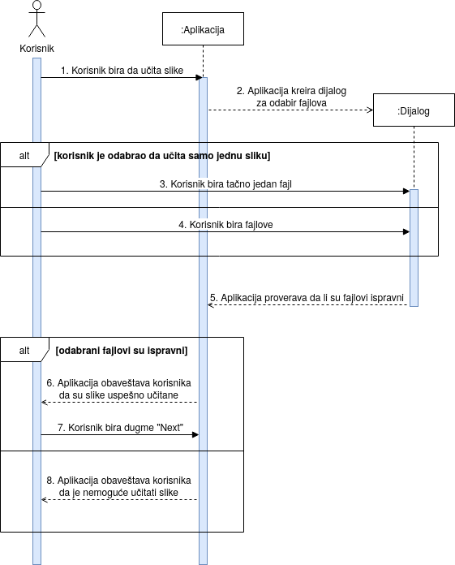

## Dijagram slučajeva upotrebe
 
___

### Slučaj upotrebe Učitavanje slika
_Kratak opis:_ Korisnik bira da li će jednu ili više slika sa svog računara konvertovati u PDF dokument.

_Akteri:_ Korisnik

_Preduslovi:_ Aplikacija je pokrenuta.

_Postuslovi:_ Slike su učitane – prikazuju se u aplikaciji i spremne su za editovanje.

_Osnovni tok:_ 

1. Korisnik bira dugme "Import image" ili dugme "Choose multiple images" iz glavnog menija.
2. Aplikacija prikazuje dijalog za odabir fajlova.
 &emsp; 2.1. Ako je korisnik odabrao da učita samo jednu sliku:
 &emsp;&emsp;&emsp; 2.1.1. Aplikacija mu dozvoljava da odabere tačno jedan fajl sa nekom od sledećih ekstenzija: .jpg, .jpeg, .png, .bmp.
 &emsp;&emsp;&emsp; 2.1.2. Prelazi se na korak 3.
 &emsp; 2.2. Ako je korisnik odabrao da učita više slika:
 &emsp;&emsp;&emsp; 2.2.1. Aplikacija mu dozvoljava da odabere više fajlova sa nekom od sledećih ekstenzija: .jpg, .jpeg, .png, .bmp.
 &emsp;&emsp;&emsp; 2.2.2. Prelazi se na korak 3.
3. Aplikacija proverava da li su odabrani fajlovi ispravni.
 &emsp; 3.1. Ako su odabrani fajlovi ispravni:
 &emsp;&emsp;&emsp; 3.1.1. Aplikacija obaveštava korisnika da su slike uspešno učitane.
 &emsp;&emsp;&emsp; 3.1.2. Aplikacija omogućava korisniku da odabere dugme "Next".
 &emsp;&emsp;&emsp; 3.1.3. Korisnik bira dugme "Next" i prelazi u prozor za editovanje slika.
 &emsp;&emsp;&emsp; 3.1.4. Prelazi se na slučaj upotrebe Editovanje slika.
 &emsp; 3.2. Ako odabrani fajlovi nisu ispravni:
 &emsp;&emsp;&emsp; 3.2.1. Aplikacija obaveštava korisnika da je nemoguće učitati slike.
 &emsp;&emsp;&emsp; 3.2.2. Prelazi se na korak 1.

_Alternativni tokovi:_
* A1: **Neočekivani izlaz iz aplikacije.** Ako u bilo kom koraku korisnik isključi aplikaciju, sve što je eventualno bilo učitano će se poništiti i aplikacija će završiti sa radom. Slučaj upotrebe se završava.

* A2: **Korisnik se predomislio.** Ako u drugom ili trećem koraku korisnik shvati da ne želi da učitava slike i konvertuje ih u PDF dokument, već želi da uradi split dokumenta ili merge dokumenata, može odabrati dugme "Split PDF" odnosno dugme "Merge PDF" iz glavnog menija. Sve što je eventualno bilo učitano se poništava i prelazi se na slučaj upotrebe Split dokumenta, odnosno slučaj upotrebe Merge dokumenata.

_Podtokovi:_ /

_Specijalni zahtevi:_ /

_Dodatne informacije:_ /

_Dijagram sekvenci:_

 

___
### Slučaj upotrebe Split dokumenta
_Kratak opis_: Korisnik želi da podeli svoj dokument na određenim stranicama. 

_Akteri_: Korisnik

_Preduslovi_: Aplikacija je pokrenuta.

_Postuslovi_: Dokument je podeljen u više novih dokumenata za koje korisnik sada ima nekoliko opcija. 

_Osnovni tok_:

1. Korisnik bira dugme "Split PDF" iz glavnog menija.
2. Aplikacija prikazuje dijalog za odabir fajlova. Dozvoljava korisniku da odabere tačno jedan fajl sa ekstenzijom .pdf.
3. Aplikacija proverava da li je odabran fajl ispravan.
 &emsp; 3.1. Ako odabran fajl nije ispravan:
 &emsp;&emsp;&emsp; 3.1.1. Aplikacija obaveštava korisnika da dokument nije ispravan.
 &emsp;&emsp;&emsp; 3.1.2. Prelazi se na korak 1.
 &emsp; 3.2. Ako odabran fajl jeste ispravan:
 &emsp;&emsp;&emsp; 3.2.1. Ako je korisnik odabrao dokument koji ima samo jednu stranicu:
 &emsp;&emsp;&emsp;&emsp;&emsp; 3.2.1.1. Aplikacija obaveštava korisnika da nije moguće podeliti takav dokument.
 &emsp;&emsp;&emsp;&emsp;&emsp; 3.2.1.2. Prelazi se na korak 1.
4. Aplikacija prikazuje dijalog za unos stranica na kojima će se podeliti dokument.
 &emsp; 4.1. Ako korisnik nije uneo ni jedan broj stranice:
 &emsp;&emsp;&emsp; 4.1.1. Aplikacija obaveštava korisnika da mora uneti broj stranice.
 &emsp;&emsp;&emsp; 4.1.2. Prelazi se na korak 1.
 &emsp; 4.2. Ako je korisnik uneo broj stranice koji nije validan:
 &emsp;&emsp;&emsp; 4.2.1. Aplikacija obaveštava korisnika da broj stranice nije validan.
 &emsp;&emsp;&emsp; 4.2.2. Prelazi se na korak 1.
5. Prelazi se na slučaj upotrebe Čuvanje dokumenta. Po završetku se prelazi na korak 6.
6. Aplikacija obaveštava korisnika da je njegov dokument uspešno podeljen.
7. Prelazi se na slučaj upotrebe Dodatno korišćenje dokumenta.

_Alternativni tokovi_:
* A1: **Neočekivani izlaz iz aplikacije.** Ako u koracima 1-5 korisnik isključi aplikaciju, sve što je eventualno bilo učitano će se poništiti i aplikacija će završiti sa radom. Slučaj upotrebe se završava.

* A2: **Korisnik se predomislio.** Ako u koracima 1-5 korisnik shvati da ne želi da deli svoj dokument, već želi da konvertuje slike u PDF dokument ili objedini više dokumenata u jedan, može odabrati drugu opciju iz glavnog menija. Sve što je eventualno bilo učitano se poništava i prelazi se na slučaj upotrebe Učitavanje slika, odnosno slučaj upotrebe Merge dokumenata.

_Podtokovi_: /

_Specijalni zahtevi_: /

_Dodatne informacije_: /

_Dijagram sekvenci:_
___
