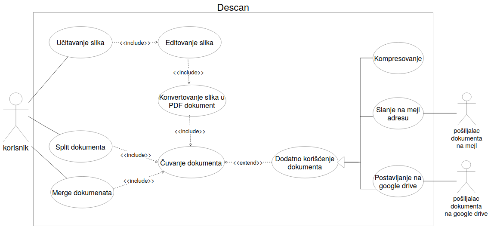

## Dijagram slučajeva upotrebe
 
___

### Slučaj upotrebe Učitavanje slika
_Kratak opis:_ Korisnik bira da li će jednu ili više slika sa svog računara konvertovati u PDF dokument.

_Akteri:_ Korisnik

_Preduslovi:_ Aplikacija je pokrenuta.

_Postuslovi:_ Slike su učitane – prikazuju se u aplikaciji i spremne su za editovanje.

_Osnovni tok:_ 

1. Korisnik bira dugme "Import image" ili dugme "Choose multiple images" iz glavnog menija.
2. Aplikacija prikazuje dijalog za odabir slika.
 2.1. Ako je korisnik odabrao da učita samo jednu sliku:
 &emsp;2.1.1. Aplikacija mu dozvoljava da odabere tačno jedan fajl sa nekom od sledećih ekstenzija: .jpg, .jpeg, .png, .bmp.
 &emsp;2.1.2. Prelazi se na korak 3.
 2.2. Ako je korisnik odabrao da učita više slika:
 &emsp;2.2.1. Aplikacija mu dozvoljava da odabere jedan ili više fajlova sa nekom od sledećih ekstenzija: .jpg, .jpeg, .png, .bmp.
 &emsp;2.2.2. Prelazi se na korak 3.
3. Aplikacija obaveštava korisnika da su slike uspešno učitane.
4. Korisnik bira dugme "Next" i prelazi se na sluačaj upotrebe Editovanje slika.

_Alternativni tokovi:_

_Podtokovi:_

_Specijalni zahtevi:_

_Dodatne informacije:_

___
### Slučaj upotrebe Editovanje slika
Kratak opis: 

Akteri: 

Preduslovi:

Postuslovi:

Osnovni tok:

Alternativni tokovi:

Podtokovi:

Specijalni zahtevi:

Dodatne informacije:
___
